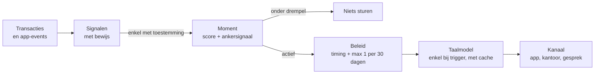

# KBC Moments

**Begeleid klanten op het juiste moment, niet met de juiste reclame.**

Proof of concept voor de **KBC Challenge** van de Tectonic Hackathon 2026. KBC herkent levensmomenten uit transacties en app-gedrag, en reageert met **één** passende actie, op het **juiste kanaal** en het **juiste tijdstip**. Elke klant ziet waarom, en beslist zelf.

> Alle data is synthetisch. Dit is geen officiële KBC-toepassing.

---

## Inhoud
- [Het probleem](#het-probleem)
- [Onze aanpak](#onze-aanpak)
- [Demo in 2 minuten](#demo-in-2-minuten)
- [Hoe het werkt](#hoe-het-werkt)
- [Waarom het schaalt naar 2,3 miljoen klanten](#waarom-het-schaalt-naar-23-miljoen-klanten)
- [Security](#security)
- [Installeren en draaien](#installeren-en-draaien)
- [Tests](#tests)
- [Deployen op Google Cloud Run](#deployen-op-google-cloud-run)
- [Projectstructuur](#projectstructuur)
- [Onafgewerkt en volgende stappen](#onafgewerkt-en-volgende-stappen)

---

## Het probleem
Banken sturen vandaag vooral productreclame: hetzelfde bericht naar grote groepen, op een willekeurig moment. Klanten haken af, en de momenten waarop een bank echt kan helpen (een eerste job, een eerste huis, het pensioen) worden gemist.

## Onze aanpak
Drie principes staan centraal:

| Principe | Wat het betekent in de app |
|---|---|
| 🔍 **Uitlegbaar** | Elke klant ziet *waarom* hij een voorstel krijgt, met het concrete bewijs: "Eerste loon van Colruyt Group NV (€2.150) op 25/07". |
| 🙋 **Klant beslist** | Toestemming per signaal. Zet een signaal uit en het voorstel past zich meteen aan. "Klopt niet voor mij" wordt onthouden. |
| 🤫 **Liever niets dan fout** | Onder 50% zekerheid, of zonder doorslaggevend signaal, wordt er niets gestuurd. Geen krediet-push. |

En één regel voor timing: **het juiste moment**. Een spaartip komt de ochtend dat het loon binnenkomt, niet op een willekeurige dinsdag. Een klant krijgt maximaal 1 proactief bericht per 30 dagen.

---

## Demo in 2 minuten
Start de app (zie [Installeren en draaien](#installeren-en-draaien)) en log in met een demo-account. Het wachtwoord is de `DEMO_PASSWORD` uit je `.env`.

| Account | Wie | Wat je ziet |
|---|---|---|
| `lotte` | 23 jaar, net begonnen te werken | Moment **"Eerste vaste job"** (100%). Voorstel: een spaarpotje van €50 per maand, gepland op **vr 23/10 om 08:00**, de ochtend van haar loon (25/10 valt op een zondag). Zet "Eerste salaris ontvangen" uit: het voorstel verdwijnt. |
| `karim` | 34 jaar, zoekt een huis | Moment **"Eerste woning"**. Kreeg op 15/09 al een bericht, dus het **contactbeleid** stelt het nieuwe bericht uit tot 15/10. |
| `jan` | 62 jaar, kijkt naar de toekomst | Moment **"Op weg naar pensioen"**. Kanaal: persoonlijk gesprek, **geen app-melding**. |
| `adviseur` | KBC-adviseur | Ziet enkel de toegewezen klanten (Lotte en Karim, niet Jan), en enkel signalen waarvoor de klant toestemming gaf. Geen ruwe transacties. |

Onderaan elke pagina toont de **schaal-view** dezelfde motor op 10.000 synthetische klanten, met een kostvergelijking voor 2,3 miljoen klanten.

---

## Hoe het werkt



**1. Signalen.** Uit transacties en app-gedrag komen 7 signalen, elk met leesbaar bewijs:

| Signaal | Bron |
|---|---|
| Eerste salaris ontvangen | eerste loonbetaling in de laatste 90 dagen |
| Nieuwe huur als vaste kost | nieuwe maandelijkse huurbetaling |
| Zocht naar sparen in de app | zoekopdracht in de app |
| Saldo onder persoonlijke buffer | saldo zakte onder €300 in de laatste 30 dagen |
| Woonlening-simulatie bekeken | app-event |
| Notariskosten betaald | betaling aan een notaris in de laatste 180 dagen |
| Pensioensimulatie bekeken | app-event |

**2. Moment.** Elk moment heeft gewichten per signaal en een **ankersignaal**. Zonder anker geen moment: huur plus een zoekopdracht plus een laag saldo bewijzen nog geen "eerste job".

| Moment | Anker | Actie | Kanaal | Timing |
|---|---|---|---|---|
| Eerste vaste job | eerste loon | Start een spaarpotje van €50 per maand | App-melding | ochtend van de loondag |
| Eerste woning | woonlening-simulatie of notaris | Bekijk je maandlast en regel je brandverzekering | Afspraak op kantoor, plus app | eerstvolgende werkdag |
| Op weg naar pensioen | pensioensimulatie | Plan een gesprek over je pensioen | Persoonlijk gesprek, geen app-melding | eerstvolgende werkdag |

**3. Beleid.** Onder 50% zekerheid: niets. Anders wordt het tijdstip bepaald:
- **Loondag:** de meest voorkomende loondag, geklemd op de maandlengte (loon op de 31e valt in korte maanden op de laatste dag). Valt die in het weekend, dan de vrijdag ervoor.
- **Contactbeleid:** maximaal 1 proactief bericht per 30 dagen. Een uitgesteld bericht valt op de eerstvolgende echte loondag.
- Loondata wordt **enkel** gebruikt met toestemming voor het loonsignaal.

**4. Taalmodel.** Enkel bij een actief moment schrijft Gemini een korte, persoonlijke boodschap in de juiste toon. Er is een cache, een timeout van 5 seconden en een vangnet: tekst met krediet- of leningtermen of verzonnen bedragen wordt geweigerd en vervangen door een standaardtekst. Zonder API-key gebruikt de app altijd de standaardtekst.

---

## Waarom het schaalt naar 2,3 miljoen klanten
- **Detectie is deterministisch en goedkoop:** 10.000 klanten in ongeveer 0,1 s op 1 CPU-kern (gemeten in de app, enkel detectie). Lineair doorgerekend is dat ongeveer een halve tot een hele minuut voor 2,3 miljoen klanten, in batch, afhankelijk van de machine.
- **Het taalmodel draait enkel waar het telt:** ongeveer 6% van de synthetische klanten heeft een moment. De rest krijgt niets, dus ook geen dure oproep.
- **Kosten:** met de aannames in de app (€0,002 per taalmodel-oproep, €0,00001 per klant voor detectie) is dit ongeveer **15× goedkoper** dan elke klant elke dag een taalmodel-oproep, met dezelfde uitleg per klant. Die kostaannames zijn illustratief, niet gemeten.

---

## Security
Security is een beoordelingscriterium (Aikido-audit: business logic, IDOR, authenticatie, autorisatie). Wat de app doet:

**Autorisatie en IDOR**
- De klant-ID komt **altijd uit de JWT**, nooit uit de URL of de body.
- Rollen worden server-side gecontroleerd per endpoint.
- De adviseur ziet enkel toegewezen klanten, enkel signalen met toestemming, en geen ruwe transacties, signaallijsten of berichten.

**Authenticatie**
- Wachtwoorden gehasht met PBKDF2 (200.000 iteraties), constante vergelijkingstijd, ook bij onbekende gebruikers.
- JWT (HS256) met verplichte `iss`, `aud`, `jti` en `exp`. Uitloggen trekt de token server-side in.
- Login-bescherming zonder lockout-misbruik:
  - enkel **mislukte** pogingen tellen, per gebruiker en IP, zodat een aanvaller elders een echte klant niet kan buitensluiten;
  - controleren en tellen gebeurt in één stap onder een lock, **vóór** het hashen, zodat ook parallelle pogingen worden afgeremd;
  - gebruikersnamen zijn beperkt tot `A-Z a-z 0-9 . _ -`;
  - het client-IP komt enkel uit `X-Forwarded-For` achter een vertrouwde proxy (`TRUST_PROXY=1` op Cloud Run), en uvicorn draait met `--no-proxy-headers`.

**Business logic**
- "Klopt niet" werkt enkel op het moment dat de klant echt te zien krijgt.
- "Eerder voorstel opnieuw tonen" maakt enkel "Klopt niet" ongedaan en zet nooit ingetrokken toestemming terug aan.
- Toestemming is overal bindend, ook voor de timing.

**Frontend en headers**
- Strikte Content-Security-Policy zonder inline scripts, HSTS, Permissions-Policy, `X-Frame-Options: DENY`, `nosniff`.
- Geen HTML-strings met data: een template-functie escapet elke waarde automatisch, en één gecontroleerde functie zet HTML in de pagina.

**Overig**
- Gedeelde state is thread-safe (lock).
- Alle versies zijn gepind, ook `starlette` en `websockets`, op versies zonder bekende kwetsbaarheden.
- Geen secrets in de repo; secrets enkel via omgevingsvariabelen.

**Aikido-resultaat:** na de fixes meldde Aikido **31 opgeloste issues**, waaronder de kritieke `starlette`-kwetsbaarheid en een XSS-waarschuwing. Er bleef één melding over: voorbeeldtekst in een verwijderd `.env.example` in de git-geschiedenis, geen echte key.

**Werkwijze:** twee onafhankelijke code-reviews, elke bevinding eerst gereproduceerd, dan een falende test, dan de fix. Zie `docs/superpowers/plans/`.

> Demo-vereenvoudiging: alle demo-accounts delen één wachtwoord uit `.env`.

---

## Installeren en draaien
Vereist: **Python 3.10 of hoger** en Git.

**1. Code ophalen**
```bash
git clone https://github.com/YasineOuaga/KBC-Moments.git
cd KBC-Moments
```

**2. Virtuele omgeving en packages**

Mac/Linux:
```bash
python3 -m venv venv
source venv/bin/activate
pip install -r requirements.txt
```
Windows (PowerShell of cmd):
```bat
python -m venv venv
venv\Scripts\activate
pip install -r requirements.txt
```

**3. Configuratie.** Kopieer `.env.example` naar `.env` (Windows: `copy .env.example .env`, Mac/Linux: `cp .env.example .env`) en vul in:

| Variabele | Verplicht | Uitleg |
|---|---|---|
| `JWT_SECRET` | ja | minstens 32 willekeurige tekens. Genereer met `python -c "import secrets; print(secrets.token_hex(32))"` |
| `DEMO_PASSWORD` | ja | minstens 8 tekens, wachtwoord voor alle demo-accounts |
| `GEMINI_API_KEY` | nee | zonder key gebruikt de app standaardteksten |
| `GEMINI_MODEL` | nee | standaard `gemini-2.5-flash` |
| `TRUST_PROXY` | nee | enkel `1` achter een vertrouwde proxy zoals Cloud Run |

**4. Starten**
```bash
cd backend
uvicorn main:app --reload --no-proxy-headers
```
Open **http://localhost:8000**.

**Problemen?**
| Melding | Oplossing |
|---|---|
| `Zet JWT_SECRET (minstens 32 tekens) in .env` | `.env` staat niet in de hoofdmap, of de secret is te kort |
| `Could not open requirements file` | je zit in `backend/`: ga eerst terug met `cd ..` |
| `uvicorn: command not found` | de venv is niet actief: voer het activate-commando uit stap 2 opnieuw uit |
| `429 Te veel pogingen` | 5 keer een fout wachtwoord: wacht 1 minuut |

---

## Tests
Vanuit de hoofdmap:
```bash
pip install -r requirements-dev.txt
pytest -q
```
42 tests voor authenticatie (vervalste tokens, `alg:none`, uitloggen, brute force, parallelle pogingen), autorisatie en IDOR, business logic (toestemming, feedback, reset), timing (loondag 29 tot 31, weekend, jaarwissel, contactbeleid) en het vangnet van het taalmodel.

---

## Deployen op Google Cloud Run
```bash
gcloud run deploy kbc-moments --source . --region europe-west1 --allow-unauthenticated \
  --min-instances=1 --max-instances=1 \
  --set-env-vars TRUST_PROXY=1,JWT_SECRET=...,DEMO_PASSWORD=...,GEMINI_API_KEY=...
```
- **Precies 1 instantie:** de state zit in het geheugen. Zo ziet de adviseur altijd de toestemming die de klant net aanpaste.
- Secrets gaan als omgevingsvariabelen mee, nooit in de image. De container draait als niet-root-gebruiker.

---

## Projectstructuur
```
KBC-Moments/
├── backend/
│   ├── engine.py        signalen, momenten, timing en contactbeleid, synthetische data
│   └── main.py          API, authenticatie, autorisatie, personalisatie via Gemini
├── frontend/
│   ├── index.html       klant-, adviseur- en schaal-view in KBC-stijl
│   └── app.js           rendering met automatische escaping
├── tests/
│   ├── test_api.py      security- en logicatests
│   └── test_engine.py   moment- en timingtests
├── docs/superpowers/plans/   plan en review-bevindingen
├── Dockerfile           container voor Cloud Run
├── requirements.txt     gepinde runtime-packages
└── .env.example         voorbeeldconfiguratie, zonder secrets
```

---

## Onafgewerkt en volgende stappen
- **Data zit in geheugen:** een herstart zet alles terug. In productie: event-streaming en een feature store, en toestemming in een database.
- **Momenten zijn regelgebaseerd:** de volgende stap is gewichten leren uit feedback ("Klopt niet").
- **Kanalen worden getoond, niet echt verstuurd:** er is geen koppeling met push, mail of agenda.
- **Drie momenten:** uitbreiden naar bijvoorbeeld gezinsuitbreiding, verhuis of een eigen zaak starten is één blok configuratie per moment.
- **Feestdagen:** de werkdaglogica houdt nog geen rekening met Belgische feestdagen.
